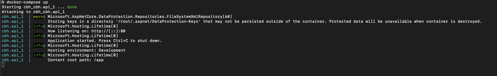
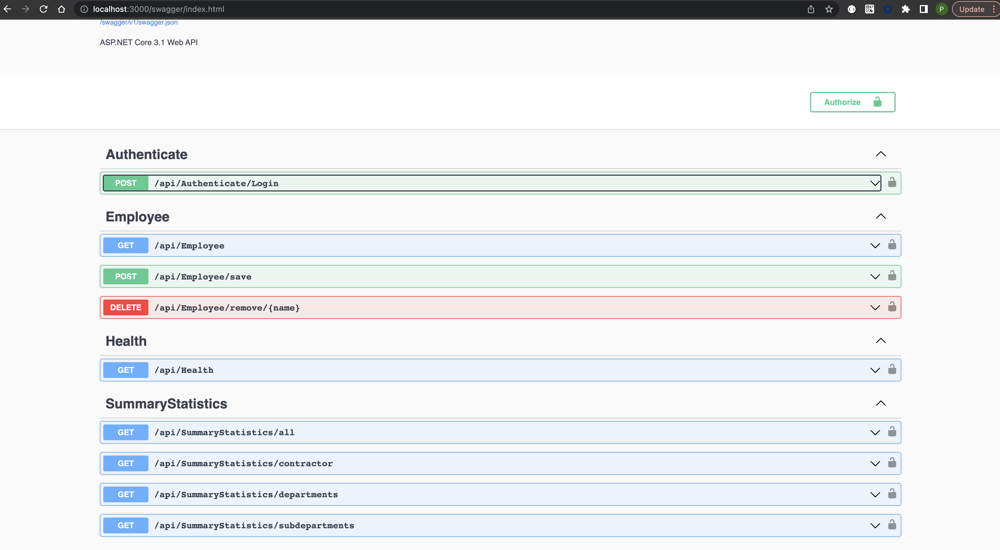
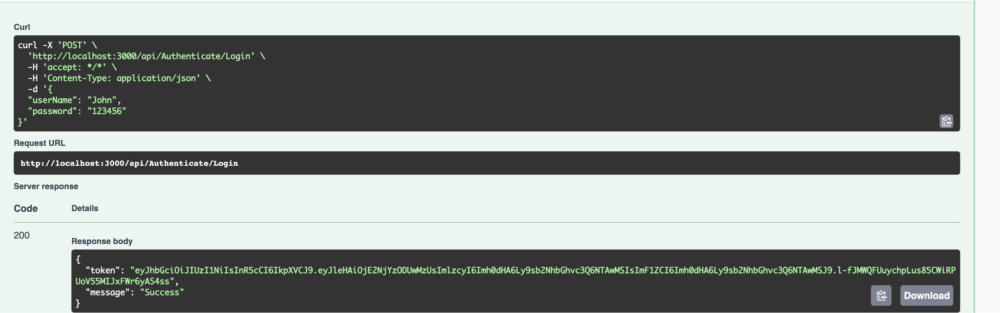
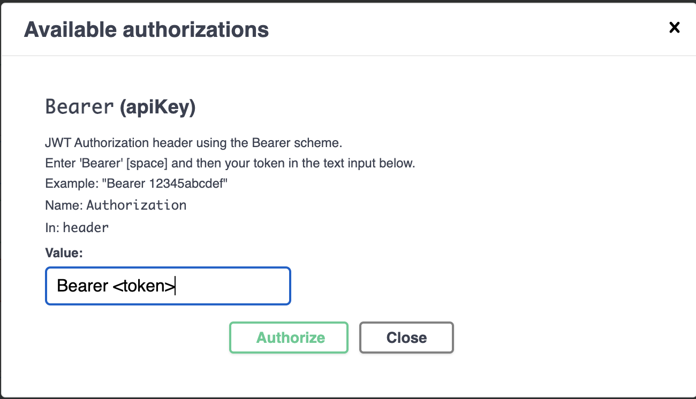
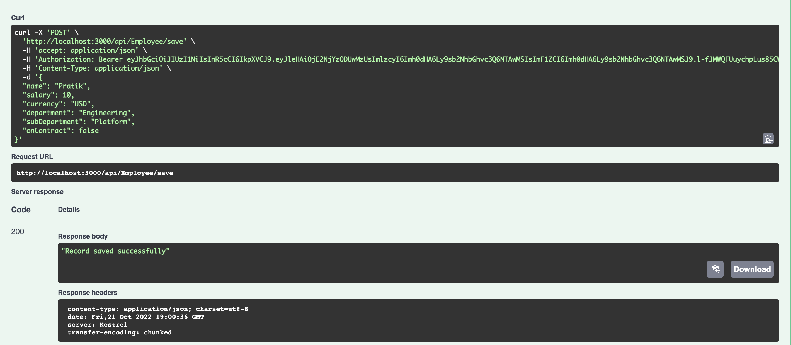
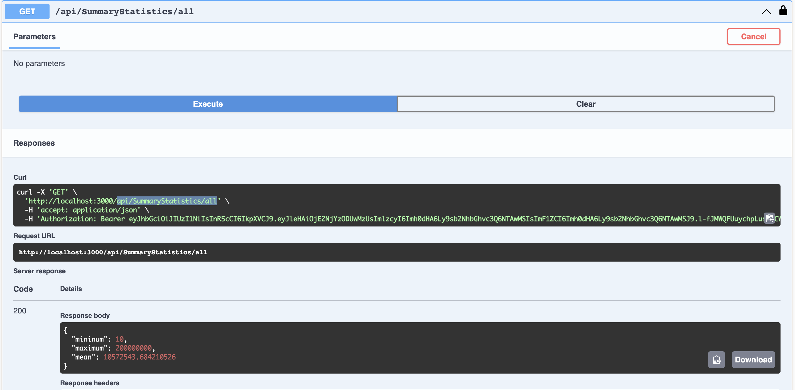
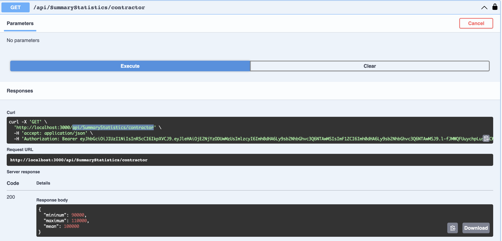
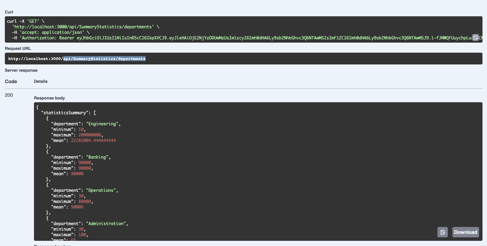
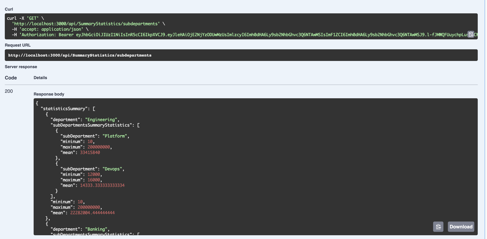
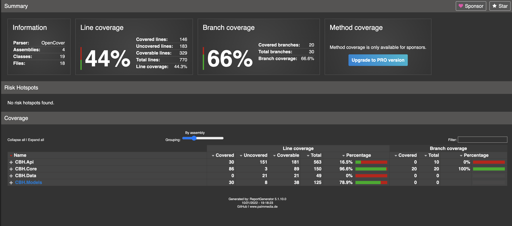

## Steps to run the project

This is implented in .net core 3.1.

To run application in local environment using `docker-compose`, perform the following:

`$ docker-compose up`

File is located at the root of the folder.

This will get the container up and running as show below

I have integrated Swagger UI to facilitate testing of the APIs.

Once the container is up and running, use [http://localhost:3000/swagger/index.html](http://localhost:3000/swagger/index.html) to load the swagger UI.

This will list down all the APIs implemented.

There are 4 controllers implemented `Health` , `Authencticate`, `Employee` and `SummaryStatistics`

### Authenticate Controller ###

1. First call the login api with below creds:
  username - John
  password -123456

  **Kindly note, for any other username & password, api will give unauthorized**
  
  For now, I have hard coded this to simulate the login functionality.
  This should generate the JWT Bearer token

  

2. Next step is to use the token generated in step 1 for authorization purpose.
   
   Click on the lock icon to open the below popup. Copy the token from step 1 and paste as shown below.

   

   Click on `Authorize`. This will save the token for the subsequent api calls

### Employee Controller ###
  
3. Get Employees API - This will give the list of all records present at that point of time.
   
   **Kindly note, I have modified original dataset and added few records with new sub-departments like Devops, HR and Support for Engineering, Administration and Operations respectively**

   During the startup, application will load the dataset from the json file and maintin the list in-memory.

4. Save Employee API - This will save new employee into dataset. 

    **Kindly note , I have intentionally kept `Deparment` & `SubDepartment` as free text instead of enumeration for simplicity.**

    **`Name`,  `Deparment` & `SubDepartment` are mandatory fields and have validation in place along with  `Salary` should be greater than 0. No validation on  `Currency` field**

    Sample request for save employees.

     

5. Delete Employee API - This will remove the employee from the dataset on the basis of the `Name` provided in the request.
   Since there is no other `Id` field in the dataset, I have used `Name` as an identifier.
   If there are multiple records with same name, all those records shall be removed.

   If `Name` is passed as empty or is not present in dataset, API shall response with `404` status code.
  
### Summary Statistics Controller ###

6. `api/SummaryStatistics/all` - To fetch the SS for the entire dataset

    Sample response 

     

7.  `api/SummaryStatistics/contractor` - To fetch the SS for records which satisfy `"on_contract": "true"`.

    Sample response

    

8.  `api/SummaryStatistics/departments` - To fetch the SS for records for each department.

    Sample response

    

8.  `api/SummaryStatistics/departments` - To fetch the SS for records for each sub-deparment along with department.

    Sample response

    

## Steps to run the Test

We will use the docker to run the test and also check the code coverage report.

Execute below commands from root of the project

1. `docker build -t test -f ./CBH/DockerfileTest .`

    This will build and generate the image name `test`

2. `docker run --name cbh_container test`

    This will run the image created in step 1 inside the continaer name `cbh_container`

3. `docker cp cbh_container:/src/CBH/coverage/. ./coverage`

    This will copy the `coverage` folder from the container to the current local folder

4. Open `coverage/index.html` file. This should show the number of tests ran along with current code coverage. Please see below for reference.

     